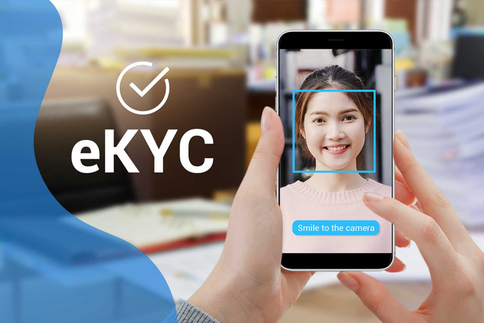
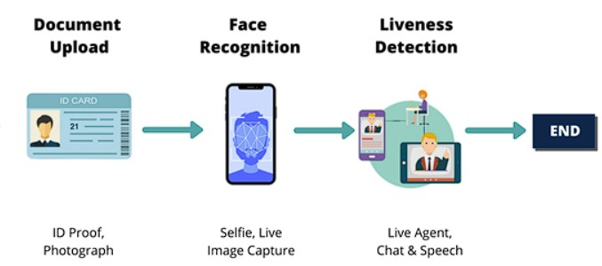

# eKYC - Electronic Know Your Customer

## Project Overview
eKYC (Electronic Know Your Customer) is a Python application designed for electronic identity verification. It aims to provide a secure and efficient way to verify customer identities online, leveraging biometric information and artificial intelligence (AI) to minimize fraud and streamline the onboarding process. The system guides users through a multi-step process, including ID document submission, live face capture, and liveness detection challenges, all managed via a PyQt5 graphical user interface.



## Features
*   **ID Document Scanning:** Allows users to upload or capture an image of their ID card for information extraction.
*   **Live Face Capture:** Captures a live image of the user via webcam.
*   **Face Verification:** Compares the live facial image with the photo extracted from the ID card using deep learning models.
*   **Liveness Detection:** Implements various challenges (e.g., blinking, smiling, head movement) to ensure the user is physically present and not using a static image or video.
*   **Multi-Page GUI:** A step-by-step user interface built with PyQt5 to guide users through the verification process.

## Modules
The project is structured into the following core modules:

*   **`facenet/`**: Handles face detection from images.
    *   `facenet/models/mtcnn.py`: Implements the MTCNN (Multi-task Cascaded Convolutional Networks) algorithm for robust face detection.
    *   `facenet/models/inception_resnet_v1.py`: Provides an Inception Resnet V1 model, often used for feature extraction in face recognition tasks.
*   **`gui/`**: Manages the PyQt5 graphical user interface, with separate pages for each step of the eKYC process:
    *   `gui/page1.py` (`IDCardPhoto`): ID document upload/capture.
    *   `gui/page2.py` (`VerificationWindow`): Live camera feed for face capture.
    *   `gui/page3.py` (`ChallengeWindow`): Liveness detection challenges.
    *   `gui/page4.py` (`ResultsWindow`): Displays verification results.
*   **`liveness_detection/`**: Contains algorithms for liveness checks to prevent spoofing.
    *   `liveness_detection/blink_detection.py`: Detects eye blinks.
    *   `liveness_detection/emotion_prediction.py`: Predicts facial emotions.
    *   `liveness_detection/face_orientation.py`: Detects the orientation of the face.
*   **`verification_models/`**: Includes models for comparing and verifying facial identities.
    *   `verification_models/VGGFace2.py`: Implements the VGGFace2 model, a deep learning model trained for face recognition, used here for face comparison.
*   **`utils/`**: Provides general utility functions used across the project.
*   **`tests/`**: Contains test scripts for various components.

## Technologies Used
*   **Programming Language:** Python
*   **Deep Learning & Computer Vision:**
    *   PyTorch (`torch`, `torchvision`)
    *   OpenCV (`opencv-python`)
    *   Dlib (`dlib`)
    *   Pillow (`Pillow`)
*   **GUI:** PyQt5 (`PyQt5`)
*   **Numerical Operations:** NumPy (`numpy`)
*   **Plotting (Optional/Development):** Matplotlib (`matplotlib`)
*   **Containerization:** Docker

## Setup and Installation

### Prerequisites
*   Python 3.x
*   pip (Python package installer)
*   Git

### 1. Clone the Repository
```bash
git clone https://github.com/manhcuong02/eKYC
cd eKYC
```

### 2. Install Dependencies
Install the required Python packages using [`requirements.txt`](requirements.txt:0):
```bash
pip install -r requirements.txt
```

### 3. Download Pre-trained Models
You need to download the pre-trained model weights for face verification and liveness detection:
*   **VGGFace Models:** Download from [Google Drive](https://drive.google.com/drive/folders/1-pEMok04-UqpeCi_yscUcIA6ytvxhvkG?usp=drive_link) and place them in the `verification_models/weights/` directory.
*   **Liveness Detection Models:** Download from [Google Drive](https://drive.google.com/drive/folders/1S6zLU8_Cgode7B7mfJWs9oforfAODaGB?usp=drive_link) and place them in the `liveness_detection/landmarks/` directory.

### Using Docker (Alternative Setup)
If you have Docker installed, you can build and run the application in a container. The [`Dockerfile`](Dockerfile:0) handles the setup of system dependencies and Python packages.

1.  **Build the Docker image:**
    ```bash
    docker build -t ekyc-app .
    ```
2.  **Run the Docker container:**
    You might need to configure X11 forwarding to display the PyQt5 GUI from within the Docker container. This can be platform-dependent. For Linux:
    ```bash
    xhost +local:docker
    docker run -it --rm -e DISPLAY=$DISPLAY -v /tmp/.X11-unix:/tmp/.X11-unix ekyc-app
    ```
    For macOS or Windows, X11 forwarding setup might differ (e.g., using XQuartz on macOS).

    *Note: Running GUI applications from Docker can be complex and might require additional configuration based on your operating system and Docker setup.*

## Usage
After completing the setup and placing the model weights in their respective directories, run the main application:
```bash
python3 main.py
```
This will launch the PyQt5 GUI, and you can proceed with the eKYC process.

## eKYC Flow Details
The eKYC process involves the following key stages:



#### 1. Upload Document (ID Card)
Initially, users are required to upload an image of their ID card. This step is essential for extracting facial information from the ID card photo.

#### 2. Face Verification
Following the document upload, the system verifies whether the user matches the individual pictured on the ID card:
*   **Still Face Capture**: Users are prompted to maintain a steady face in front of the camera.
*   **Face Matching**: Advanced facial recognition technology compares the live image of the user's face with the photo on the ID card.

#### 3. Liveness Detection
To ensure the user's physical presence and prevent spoofing attempts using static images or videos, liveness detection challenges are performed:
*   **Liveness Challenges**: Users are required to perform specific actions, such as blinking, smiling, or turning their head.
*   **Successful Liveness Verification**: Successful completion of these challenges confirms the user's authenticity.

These combined steps provide a comprehensive identity verification process, enhancing security.

## Update Notes
*   7/12/2024: The source code has been rewritten and tested to be compatible with the VGGFace2 model (InceptionResnetV1). Testing has primarily focused on using Norm L2 for face matching.

## Results
> [!Note]
> Due to concerns about personal information, video results have been excluded from the repository.
